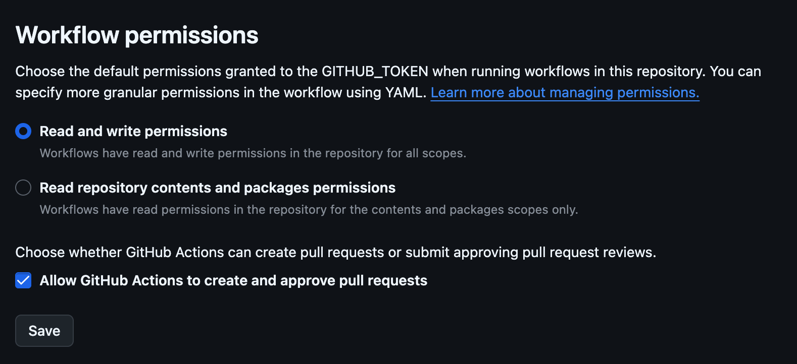

# super-changelog
SuperChangelog is a tool for aggregating CHANGELOG.md files from individual repositories into one SUPERCHANGELOG

## About the Project
Super-changelog is a python-based automation tool that aggregates activity across all public repositories in a GitHub organization. Each week, it collects repository statistics, such as, commits, pull requests, issues, and contributor activity, via the GitHub API and parses individual CHANGELOG.md files to produce two pull requests: a full weekly stats report and a condensed summary. It also supports generating historical data for a custom date range, which can be used for archival decisions, activity audits, and reporting.

<!---
### Project Vision
**{project vision}** -->

<!--
### Project Mission
**{project mission}** -->

### Agency Mission
This project supports the agency's broader source code stewardship initiative, focused on bringing all repositories up to open source and repository hygiene standards.

### Team Mission
Our team is committed to building tools that make open source development complemented with repository hygiene easier for federal development teams, focusing on automation and accuracy to reduce manual overhead.

## Core Team

A list of core team members responsible for the code and documentation in this repository can be found in [COMMUNITY.md](COMMUNITY.md).

## Repository Structure

```plaintext
.
├── .github
│   ├── .gitleaks.toml
│   ├── ISSUE_TEMPLATE
│   └── workflows
├── changelog_data
│   ├── data
│   └── summaries
└── scripts
    ├── __init__.py
    ├── __pycache__
    ├── create_pr.py
    ├── create_pr_condensed.py
    ├── generate_changelog_all.py
    ├── generate_changelog_historical.py
    ├── generate_changelog_weekly.py
    ├── generate_summary.py
    ├── generate_summary_condensed.py
    ├── run_weekly.py
    └── util.py
```
**scripts/** &mdash; All autmation logic lives here. The weekly pipeline is orchestrated by `run_weekly.py`, which calls the generation and PR creation scripts in sequence. `utils.py` provides the shared `ChangelogGenerator` class used by both the weekly and historical scripts.

**changelog_data/data/** &mdash; Output directory for generated JSON files created at runtime (These files are merged in through a PR).

**.github/workflows/** &mdash; GitHub Actions workflows that run the weekly pipeline automatically on a schedule.


<!-- TODO: Add a 'table of contents" for your documentation. Tier 0/1 projects with simple README.md files without many sections may or may not need this, but it is still extremely helpful to provide "bookmark" or "anchor" links to specific sections of your file to be referenced in tickets, docs, or other communication channels. -->

# Development and Software Delivery Lifecycle

The following guide is for members of the project team who have access to the repository as well as code contributors. The main difference between internal and external contributions is that external contributors will need to fork the project and will not be able to merge their own pull requests. For more information on contributing, see: [CONTRIBUTING.md](./CONTRIBUTING.md).

## Local Development

<!--- TODO - with example below:
This project is monorepo with several apps. Please see the [api](./api/README.md) and [frontend](./frontend/README.md) READMEs for information on spinning up those projects locally. Also see the project [documentation](./documentation) for more info.
-->

To run super-changelog locally, you will need Python 3.x and a GitHub personal access token with `repo` and `read:org` scopes for the target organization.

#### Token
A `GH_TOKEN` is needed for this action for writing issues and pull requests. Set it as the permissions below:
```
permissions:
  contents: write
  pull-requests: write
  issues: write
```

⚠️ Please make sure the following are enabled within your Repository Action Settings in order to work properly ⚠️
 

1. Clone the repository:
```bash
git clone git@github.com:DSACMS/super-changelog.git
cd super-changelog
```

2. Install dependencies:
```bash
pip install -r requirements.txt
```

3. Set required environnment variables:
```bash
export GH_TOKEN=your_github_token
export ORG_NAME=YourGitHubOrg # currently defaults to DSACMS if not set
```

4. Run the weekly pipeline:
```bash
python scripts/run_weekly.py
```
 **or**

5. Generate a historical report with a custom date range
```bash
export START_DATE=2025-01-01 (Example)
export END_DATE=2025-05-30 (Example)

python scripts/generate_changelog_historical.py
```

Historical output is saved to:
`changelog_data/data/historical_changelog_{START_DATE}_to_{END_DATE}.json`.

>**Note:** The target organization's repositories must be **public**. Super-changelog is org-agnostic &mdash; it works with any GitHub organization, not just DSACMS.

### What It Produces
Each weekly run creates two pull requests and a JSON data file:

**Full weekly report PR** (`weekly-changelog-{date}`) &mdash; A markdown file listing all active repositories for the week: commits, pull requests, contributors, and CHANGELOG.md entries from each repo in the organization.

**Condensed summary PR** (`weekly-changelog-condensed-{date}`) &mdash; A shorter, human-readable summary with quick stats and a list of active repositories.

Example:
```markdown
# 📋 Weekly Changelog
**Period**: 2026-05-01 to 2026-05-08

## 📊 Quick Stats
- **Active Repositories**: 51/83
- 📦 **Commits**: 60 | 🔀 **Pull Requests**: 112 | ❗️ **Issues**: 2

## ✅ Added
*New features and additions*

### .github
- [Add speaking](https://github.com/DSACMS/.github/pull/13)

## 🚀 Active Repositories

- **[iv-cbv-payroll](https://github.com/DSACMS/iv-cbv-payroll)**: 25 commits, 40 pulls
- **[pra-guides](https://github.com/DSACMS/pra-guides)**: 5 commits, 13 pulls, 1 issues
- *...and 41 more repositories*
---
*🤖 Generated automatically on 2026-05-08T02:55:27.493320+00:00*
```

**JSON data file** &mdash; Included in both the full report PR and the condensed version. Contains structured repository data suitable for downstream use: dashboards, archival tooling, reporting pipelines, or other automation that needs org-level activity data.

#### Historical Data
The `generate_changelog_historical.py` script collects the same data that the weekly run collects, but for any selected date range. This is great for:
- Identifying inactive repositories as candidates for archival
- Auditing contributor activity across a period
- Generating reports for leadership or stakeholder communications
- Feeding data into tools

## Coding Style and Linters

<!-- TODO - Add the repo's linting and code style guidelines -->

Each application has its own linting and testing guidelines. Lint and code tests are run on each commit, so linters and tests should be run locally before committing.

## Branching Model
This project follows [trunk-based development](https://trunkbaseddevelopment.com/), which means:

* Make small changes in [short-lived feature branches](https://trunkbaseddevelopment.com/short-lived-feature-branches/) and merge to `main` frequently.
* Be open to submitting multiple small pull requests for a single ticket (i.e. reference the same ticket across multiple pull requests).
* Treat each change you merge to `main` as immediately deployable to production. Do not merge changes that depend on subsequent changes you plan to make, even if you plan to make those changes shortly.
* Ticket any unfinished or partially finished work.
* Tests should be written for changes introduced, and adhere to the text percentage threshold determined by the project.

This project uses **continuous deployment** using [Github Actions](https://github.com/features/actions) which is configured in the [./github/workflows](.github/workflows) directory.

Pull-requests are merged to `main` and the changes are immediately deployed to the development environment. Releases are created to push changes to production.

## Contributing

Thank you for considering contributing to an Open Source project of the US Government! For more information about our contribution guidelines, see [CONTRIBUTING.md](CONTRIBUTING.md).

## Community

The super-changelog team is taking a community-first and open source approach to the product development of this tool. We believe government software should be made in the open and be built and licensed such that anyone can download the code, run it themselves without paying money to third parties or using proprietary software, and use it as they will.

We know that we can learn from a wide variety of communities, including those who will use or will be impacted by the tool, who are experts in technology, or who have experience with similar technologies deployed in other spaces. We are dedicated to creating forums for continuous conversation and feedback to help shape the design and development of the tool.

We also recognize capacity building as a key part of involving a diverse open source community. We are doing our best to use accessible language, provide technical and process documents, and offer support to community members with a wide variety of backgrounds and skillsets.

### Community Guidelines

Principles and guidelines for participating in our open source community are can be found in [COMMUNITY.md](COMMUNITY.md). Please read them before joining or starting a conversation in this repo or one of the channels listed below. All community members and participants are expected to adhere to the community guidelines and code of conduct when participating in community spaces including: code repositories, communication channels and venues, and events.

<!--
## Governance
Information about how the super-changelog community is governed may be found in [GOVERNANCE.md](GOVERNANCE.md).
-->

## Feedback

If you have ideas for how we can improve or add to our capacity building efforts and methods for welcoming people into our community, please let us know at opensource@cms.hhs.gov. If you would like to comment on the tool itself, please let us know by filing an **issue on our GitHub repository.**

<!--
## Glossary
Information about terminology and acronyms used in this documentation may be found in [GLOSSARY.md](GLOSSARY.md).
-->

## Policies

### Open Source Policy

We adhere to the [CMS Open Source
Policy](https://github.com/CMSGov/cms-open-source-policy). If you have any
questions, just [shoot us an email](mailto:opensource@cms.hhs.gov).

### Security and Responsible Disclosure Policy

_Submit a vulnerability:_ Vulnerability reports can be submitted through [Bugcrowd](https://bugcrowd.com/cms-vdp). Reports may be submitted anonymously. If you share contact information, we will acknowledge receipt of your report within 3 business days.

For more information about our Security, Vulnerability, and Responsible Disclosure Policies, see [SECURITY.md](SECURITY.md).

### Software Bill of Materials (SBOM)

A Software Bill of Materials (SBOM) is a formal record containing the details and supply chain relationships of various components used in building software.

In the spirit of [Executive Order 14028 - Improving the Nation’s Cyber Security](https://www.gsa.gov/technology/it-contract-vehicles-and-purchasing-programs/information-technology-category/it-security/executive-order-14028), a SBOM for this repository is provided here: https://github.com/DSACMS/super-changelog/network/dependencies.

For more information and resources about SBOMs, visit: https://www.cisa.gov/sbom.

## Public domain

This project is in the public domain within the United States, and copyright and related rights in the work worldwide are waived through the [CC0 1.0 Universal public domain dedication](https://creativecommons.org/publicdomain/zero/1.0/) as indicated in [LICENSE](LICENSE).

All contributions to this project will be released under the CC0 dedication. By submitting a pull request or issue, you are agreeing to comply with this waiver of copyright interest. 

